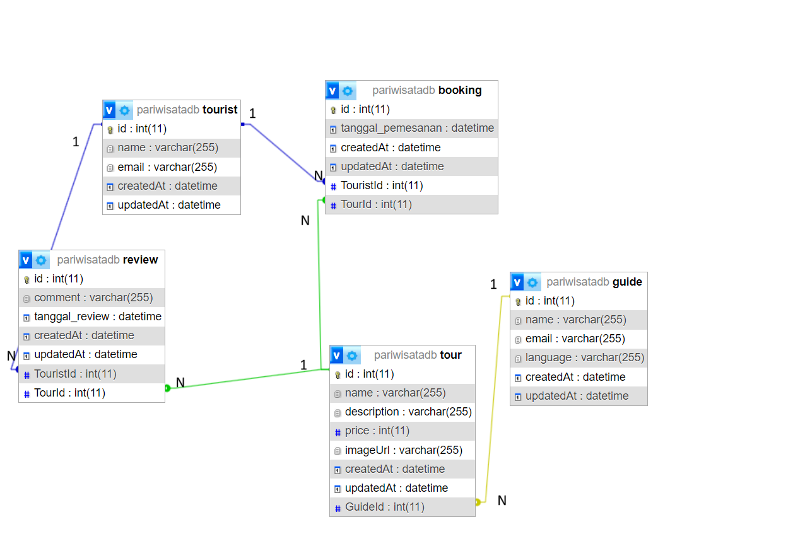

# REST API TRAVEL MANAGEMENT SYSTEM
Merupakan sebuah REST API yang dibuat untuk memanajemen sebuah sistem Travel yang sederhana. Memungkinkan penggunanya untuk melakukan operasi CRUD pada tourist, tour guide, dan Review

## Teknologi yang digunakan
- `Express JS`

- `Sequelize`

- `Mysql`

- `Dotenv`

- `Nodemon`

# Class Diagram

